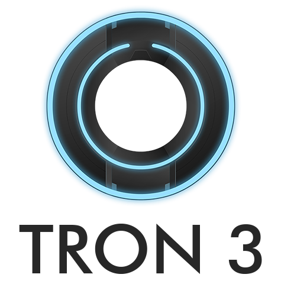

<!--suppress HtmlDeprecatedAttribute, CheckImageSize -->

<h1 align="center">
    
</h1>

<h6 align="center">Overview</h6>
<h4 align="center">
A dead-simple voice channel notifications bot for your Discord server
</h4>

  
  
  

> **Note:** This branch is for the bot's `v2` version, if you want to see versions prior to `v2` go to
> the [`legacy`](https://github.com/zakuciael/tron3/tree/legacy/) branch.

## Installation

This version is currently in the `development` stage, and the download is not yet available.

## License

MIT © [Krzysztof Saczuk \<zakku@zakku.eu\>](https://github.com/zakuciael)