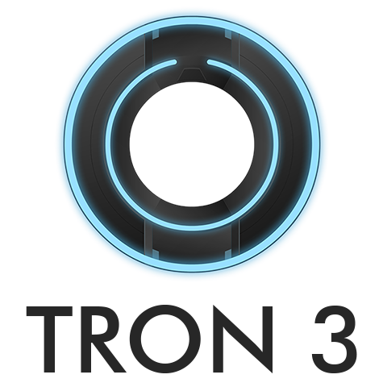

<div align="center">


A dead-simple voice channel notifications bot for your Discord server

[](https://discord.js.org/#/)
[](https://github.com/zakuciael/tron3/blob/main/LICENSE)
</div>

## Self-hosting
1. Go to [Discord developer portal](https://discord.com/developers/applications) and create a new bot application with `PRESENCE INTENT` setting.
2. Copy the bot token to the clipboard
3. Create `config.json` file with the following content:
```json
{
  "token": "<DISCORD TOKEN>",
  "guilds": {}
}
```
> Note: Replace `<DISCORD TOKEN>` with the token from the clipboard.
4. Create a `docker-compose.yml` file with following settings:
```yaml
version: '3'

services:
  tron3:
    container_name: tron3
    image: ghcr.io/zakuciael/tron3:latest
    restart: always
    volumes:
      - $PWD/config.json:/app/config.json
```
5. Start the bot using `docker-compose up -d` command.
