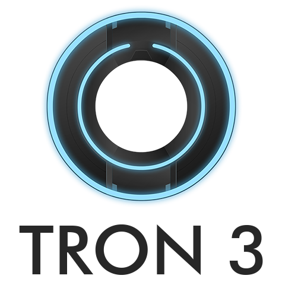

A dead-simple voice channel notifications bot for your Discord server

# Features
 - Slash commands support
 - Voice channel notifications
 - User settings

# Installation
> This section is under the development

# Usage
> This section is under the development

# License
Licensed under GNU Affero General Public License v3.0 or later.